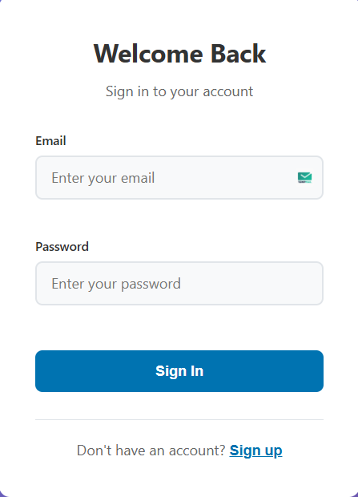
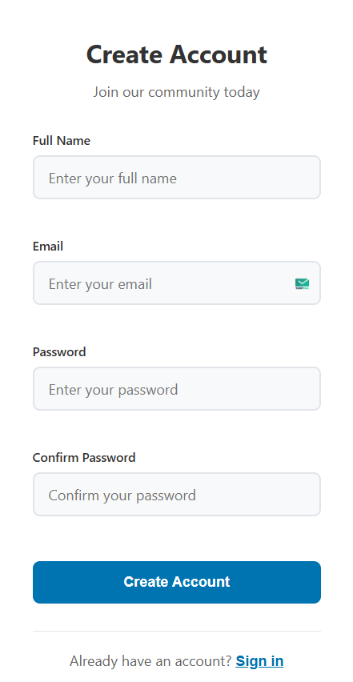
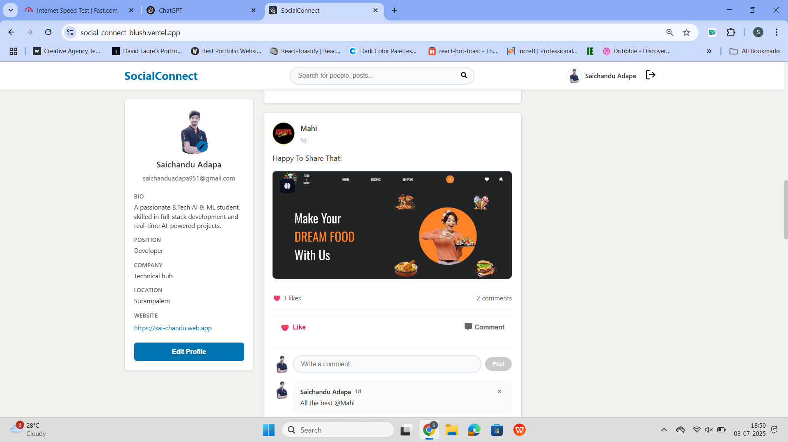
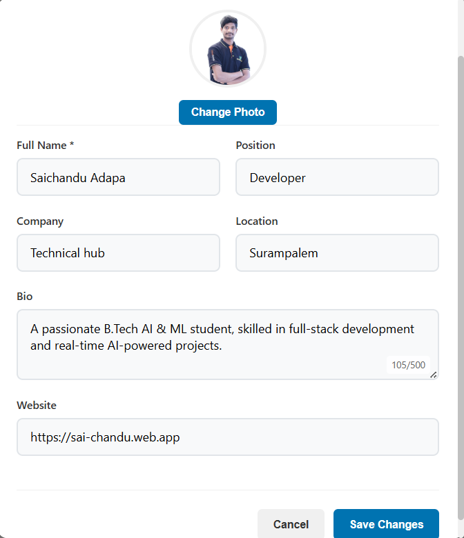

# SocialConnect – A Real-Time Social Media App (MERN Stack)

  

## Live :- https://social-connect-blush.vercel.app/
## 🚀 About the Project

**SocialConnect** is a fully responsive social media app built using the **MERN stack** (MongoDB, Express, React, Node.js). It supports **real-time communication** with **Socket.IO**, and looks and works similarly to LinkedIn. Users can create profiles, post updates, like, and comment — all updated in real time.

This app keeps things simple — it doesn’t use complex login systems. Instead, it uses `localStorage` to remember users after login.

---

## ✨ Features

Here's what you can do with SocialConnect:

- **Login & Signup**  
  Simple user registration and login. The app keeps users logged in using `localStorage`.

- **Manage Your Profile**  
  Add or update your name, bio, job position, company, location, and website. Upload a profile picture to personalize your account.

- **Create & Delete Posts**  
  Share text posts and add images if you want. You can also delete your own posts.

- **Real-Time Likes & Comments**  
  Using Socket.IO, likes and comments show up instantly for everyone — no page refresh needed.

- **Comment Section**  
  Each post has its own comment section. Comments appear with the user’s name and profile picture — just like LinkedIn.

- **Like Posts**  
  Tap the heart ❤️ to like or unlike posts. Changes show in real-time across the platform.

- **Responsive Design**  
  Works smoothly on all devices – desktop, tablet, and mobile. The clean UI uses white, blue, and gray tones, similar to LinkedIn.

- **Notifications**  
  Friendly toast messages (via `react-hot-toast`) let you know when actions like saving or posting succeed or fail.

---

## 📸 Screenshots

### 🔐 Login Page  
Sign in to your account  

### 📝 Registration Page  
Create a new account  

### 📰 Feed Page  
View and interact with posts in real-time  

### 🧑‍💼 Profile Edit Modal  
Update your personal info and profile image  

---

## 🛠️ Tech Stack

### Backend

- **Node.js** – Runs the backend server
- **Express.js** – Handles API requests
- **MongoDB** – Stores user, post, and comment data
- **Mongoose** – Helps manage MongoDB with schema models
- **Socket.IO** – Powers real-time features (likes/comments)
- **Multer** – Manages image uploads
- **CORS** – Allows frontend to connect with backend

### Frontend

- **React** – Builds the user interface
- **Axios** – Makes HTTP requests to backend
- **Socket.IO Client** – Connects to backend in real-time
- **React Hot Toast** – Shows user-friendly notifications
- **CSS3** – Styles the app with responsive layouts

---

